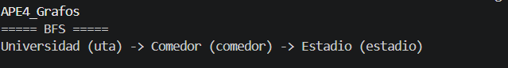
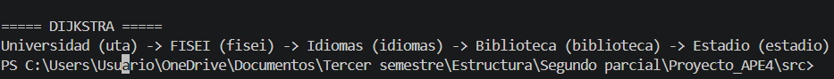
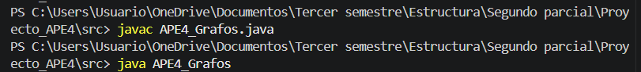
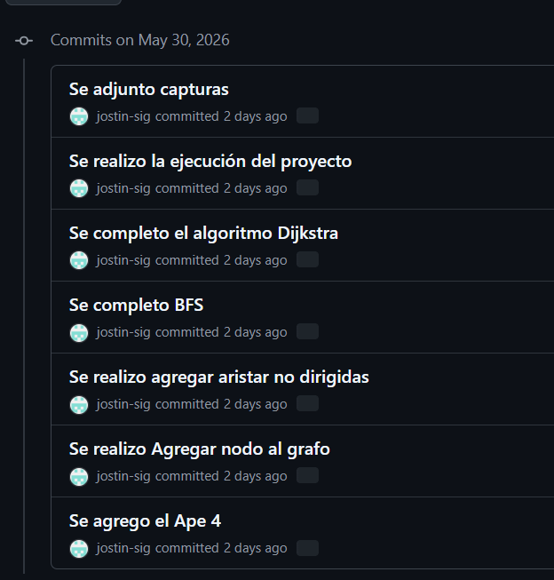

# APE 4 — Grafos: Mapa del Campus UTA

## Estructura de Datos — Universidad Técnica de Ambato

---

# Objetivo

Implementar un grafo utilizando lista de adyacencia para representar rutas dentro del Campus Huachi de la UTA y comparar los algoritmos BFS y Dijkstra.

---

# Actividades a realizar

Completar los métodos marcados con `TODO` dentro del archivo:

```bash
APE4_Grafos.java
```

Los métodos a desarrollar son:

* `agregarNodo()`
* `agregarArista()`
* `bfs()`
* `dijkstra()`

---

# Instrucciones

1. NO modificar la estructura principal del programa.
2. Completar únicamente las secciones marcadas con `TODO`.
3. Mantener el funcionamiento correcto del programa.
4. Compilar y ejecutar correctamente el archivo.
5. Comparar los resultados obtenidos entre:

   * BFS → ruta con menos paradas.
   * Dijkstra → ruta con menor distancia.
6. Comentar el código implementado.

---

# Importante

El archivo contiene métodos incompletos (`TODO`).

Es normal que VS Code muestre errores mientras los métodos no hayan sido completados.

---

# Evidencias requeridas

Tomar capturas de pantalla de:

* Consola ejecutando el programa.
* Resultado del algoritmo BFS.
* Resultado del algoritmo Dijkstra.

---

# Entrega en GitHub

Subir el proyecto completo a GitHub utilizando la siguiente estructura:

```text
Proyecto_APE4/
│
├── src/
│   └── APE4_Grafos.java
│
├── captura/
│   └── captura1.png
│
└── README.md
```

---

# Compilación y ejecución

## Compilar

```bash
javac APE4_Grafos.java
```

## Ejecutar

```bash
java APE4_Grafos
```

---

# Conceptos importantes

## BFS (Breadth-First Search)

Busca la ruta con menor número de paradas o nodos intermedios.

---

## Dijkstra

Busca la ruta con menor distancia total considerando el peso de las aristas.

---

## Lista de adyacencia

Representa para cada nodo una lista de vecinos conectados.

Es eficiente para grafos dispersos.

---

# Resultados esperados

El estudiante desarrollará habilidades para:

* representar problemas reales mediante grafos,
* implementar grafos usando lista de adyacencia,
* comprender el funcionamiento de BFS y Dijkstra,
* calcular rutas entre ubicaciones,
* comparar algoritmos de búsqueda y caminos mínimos.

---

# Autor

Grupo 8 — Estructura de Datos
Universidad Técnica de Ambato

# APE 4 — Grafos: Mapa del Campus UTA
 
**Universidad Técnica de Ambato**  
Facultad de Ingeniería en Sistemas, Electrónica e Industrial  
Carrera de Software — Estructura de Datos   
Docente: Ing. José Caiza, Mg.  
Estudiante: Sigcha Arcos Justin Israel
 
---
 
 
## Métodos que completé
 
### `agregarNodo(String id, String nombre)`
Crea un objeto `Nodo` con el identificador y nombre recibidos, lo registra en el mapa `nodos` e inicializa su lista de adyacencia vacía en el mapa `adyacencia`. Sin esto, los demás métodos lanzarían `NullPointerException` al intentar acceder a los vecinos.
 
```java
public void agregarNodo(String id, String nombre) {
    Nodo nodo = new Nodo(id, nombre);
    nodos.put(id, nodo);
    adyacencia.put(id, new ArrayList<>());
}
```
 
---
 
### `agregarArista`
Conecta dos nodos de forma bidireccional (grafo no dirigido). Agrega la arista en ambas direcciones: origen→destino y destino→origen, con el mismo peso (distancia en metros).
 
```java
public void agregarArista(String origen, String destino, int peso) {
    adyacencia.get(origen).add(new Arista(destino, peso));
    adyacencia.get(destino).add(new Arista(origen, peso));
}
```
 
---
 
### `bfs(String inicio, String fin)`
Búsqueda por anchura usando una cola de caminos completos (`Queue<List<String>>`). Explora nivel por nivel desde el nodo inicio. El primer camino que llega al destino es el de menor número de paradas, ya que BFS garantiza recorrer los nodos por niveles antes de avanzar más lejos.
 
```java
// Se agrega el nodo inicio al camino inicial
caminoInicial.add(inicio);
cola.add(caminoInicial);
visitados.add(inicio);
 
while (!cola.isEmpty()) {
    List<String> camino = cola.poll();
    String actual = camino.get(camino.size() - 1);
    if (actual.equals(fin)) return camino;
 
    for (Arista arista : adyacencia.get(actual)) {
        if (!visitados.contains(arista.destino)) {
            visitados.add(arista.destino);
            List<String> nuevoCamino = new ArrayList<>(camino);
            nuevoCamino.add(arista.destino);
            cola.add(nuevoCamino);
        }
    }
}
```
 
---
 
### `dijkstra(String inicio, String fin)`
Algoritmo de Dijkstra con cola de prioridad ordenada por distancia acumulada. Inicializa todas las distancias en infinito (`Integer.MAX_VALUE`) y la del nodo inicio en 0. En cada iteración procesa el nodo con menor distancia y actualiza las distancias de sus vecinos si encuentra un camino más corto. Al finalizar reconstruye el camino usando el mapa `anteriores`.
 
```java
// Inicializar distancias
for (String nodo : nodos.keySet()) {
    distancias.put(nodo, Integer.MAX_VALUE);
}
distancias.put(inicio, 0);
cola.add(inicio);
 
while (!cola.isEmpty()) {
    String actual = cola.poll();
    if (actual.equals(fin)) break;
 
    for (Arista arista : adyacencia.get(actual)) {
        int nuevaDistancia = distancias.get(actual) + arista.peso;
        if (nuevaDistancia < distancias.get(arista.destino)) {
            distancias.put(arista.destino, nuevaDistancia);
            anteriores.put(arista.destino, actual);
            cola.add(arista.destino);
        }
    }
}
```
 
---
 
## Grafo del Campus Huachi
 
| Nodo        | Nombre       | Conectado con        | Distancias   |
|-------------|--------------|----------------------|--------------|
| uta         | Universidad  | fisei, comedor       | 50m / 20m    |
| fisei       | FISEI        | uta, idiomas         | 50m / 40m    |
| idiomas     | Idiomas      | fisei, biblioteca    | 40m / 30m    |
| biblioteca  | Biblioteca   | idiomas, estadio     | 30m / 70m    |
| estadio     | Estadio      | biblioteca, comedor  | 70m / 200m   |
| comedor     | Comedor      | uta, estadio         | 20m / 200m   |
 
---
 
## Compilar y ejecutar
 
```bash
# Entrar a la carpeta src
cd src
 
# Compilar
javac APE4_Grafos.java
 
# Ejecutar
java APE4_Grafos
```
 
---
 
## Resultados obtenidos
 
### BFS — ruta con menos paradas
```
===== BFS =====
Universidad (uta) -> Comedor (comedor) -> Estadio (estadio)
```
> 2 paradas | Distancia acumulada: 20 + 200 = **220 metros**
 
BFS no considera pesos. Encontró la ruta más corta en saltos (2 paradas) pasando por Comedor, aunque acumula más metros.


 
---
 
### Dijkstra — ruta con menor distancia
```
===== DIJKSTRA =====
Universidad (uta) -> FISEI (fisei) -> Idiomas (idiomas) -> Biblioteca (biblioteca) -> Estadio (estadio)
```
> 4 paradas | Distancia acumulada: 50 + 40 + 30 + 70 = **190 metros**
 
Dijkstra sí considera los pesos. Encontró la ruta más corta en metros (190m) aunque tiene más paradas.


 
---
 
## Comparación BFS vs Dijkstra
 
| Criterio             | BFS                    | Dijkstra                                        |
|----------------------|------------------------|-------------------------------------------------|
| Optimiza             | Número de saltos       | Distancia total acumulada                       |
| Ruta encontrada      | uta→comedor→estadio    | uta→fisei→idiomas→biblioteca→estadio            |
| Paradas              | 2                      | 4                                               |
| Distancia total      | 220 metros             | 190 metros                                      |
| Considera pesos      | No                     | Sí                                              |
| Estructura de datos  | Cola (Queue)           | Cola de prioridad (PriorityQueue)               |
| Complejidad          | O(V + E)               | O((V + E) log V)                                |
 
---
 
## Capturas de ejecución
 
### Compilación y ejecución en Git Bash

 
### Resultado BFS en consola

 
### Resultado Dijkstra en consola

 
---
 
## Estructura del proyecto
 
```
Proyecto_APE4/
│
├── src/
│   └── APE4_Grafos.java
│
├── captura/
│   ├── captura1.png
│   ├── captura2.png
│   └── captura3.png
│
└── README.md
```
 
---
 
## Tecnologías utilizadas
 
- Java JDK 21
- Visual Studio Code + Extension Pack for Java
- Git Bash
- GitHub
---
 
## Historial de commits
 


---

## Conclusión
Esta práctica permitió comprender la diferencia clave entre BFS y Dijkstra:
BFS encuentra la ruta con menos paradas sin considerar distancias, mientras que
Dijkstra encuentra la ruta más corta en distancia considerando el peso de cada conexión.
En grafos ponderados como el mapa del campus, Dijkstra es el algoritmo correcto
cuando se quiere minimizar el recorrido real en metros.

